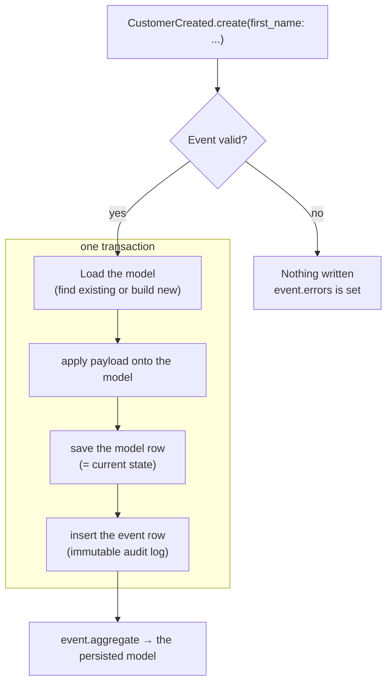

# RailsMicroEventSourcing

The smallest event sourcing you can get away with in Rails: **the event _is_ the model.**

You write one ActiveRecord class per event. It declares which model it changes
(`aggregate_class`), what it carries (`event_attributes`), and its own validations.
Creating it validates the event, applies the change to the related model, and stores
the event — atomically, in one transaction.

There are no commands, no command handlers, no registry, no result objects, no event
bus, no snapshots, no schema versioning, and no web UI. The model row is the current
state; events are an append-only **audit log**, never replayed.

If you want the fuller-featured sibling (commands, handlers, subscriptions, snapshots,
schema versioning, an events viewer), use
[rails_simple_event_sourcing](https://github.com/dbackowski/rails_simple_event_sourcing).
This gem is the deliberately stripped-down version.

## How it works

Creating an event is the whole write path. Validation, the change to your model, and
the audit row all happen in one transaction — if the event is invalid, nothing is
touched.



The model row is the source of truth; the event row is a permanent record of what
changed. Events are never replayed.

## How it compares

| | `rails_simple_event_sourcing` | `rails_micro_event_sourcing` |
|---|---|---|
| Write path | Command → Handler → Event | **Event only** |
| Validation | on Commands | **on Events** (`ActiveModel::Errors`) |
| Reconstruction | replays events (+ snapshots) | **model row is the state** (no replay) |
| Event bus / subscribers | ✅ | ❌ (use `after_commit`) |
| Snapshots / schema versioning | ✅ | ❌ |
| Events viewer (web UI) | ✅ | ❌ |
| Read-only aggregates | always on | **opt-in per model** |
| Metadata tracking | ✅ | ✅ |

## Requirements

- Ruby >= 3.2
- Rails >= 7.1
- PostgreSQL (uses `jsonb` for payload/metadata)

## Installation

```ruby
# Gemfile
gem "rails_micro_event_sourcing"
```

```bash
bundle install
bin/rails rails_micro_event_sourcing:install:migrations
bin/rails db:migrate
```

This creates the `rails_micro_event_sourcing_events` table. No columns are added to
your own tables.

## Usage

### 1. Make a model an aggregate

```ruby
class Customer < ApplicationRecord
  include RailsMicroEventSourcing::Eventable
end
```

This adds `customer.events`. By default the model still accepts direct writes — the
gem is additive. To make events the *only* way to change it:

```ruby
class Customer < ApplicationRecord
  include RailsMicroEventSourcing::Eventable
  enforce_events_only! # direct writes now raise ActiveRecord::ReadOnlyRecord
end
```

#### What the guard does and doesn't cover

`enforce_events_only!` works through `readonly?`, which Rails consults when saving or
destroying a *record*. So the line is instantiated vs. not:

| Raises `ReadOnlyRecord` | Goes through untouched |
|---|---|
| `create` / `create!` | `Customer.where(…).update_all` |
| `update` / `update!` | `Customer.insert_all` / `upsert_all` |
| `update_attribute` / `update_columns` | `Customer.where(…).delete_all` |
| `touch` | `customer.delete` |
| `destroy` / `destroy!` / `destroy_all` | raw SQL |

Every path ordinary app code takes by accident is stopped. Relation-level SQL never
builds a record, so `readonly?` is never consulted — a data migration doing
`Customer.where(…).update_all(…)` rewrites state with no event and no error. Treat this
as a guard against accidental writes, not as a security boundary.

The events table *can* have a real database-level guarantee, because it is insert-only
by design. One grant, no trigger:

```sql
REVOKE UPDATE, DELETE ON rails_micro_event_sourcing_events FROM your_app_role;
```

Your own tables get no equivalent — the gem itself has to `UPDATE` them when applying
an event.

### 2. Write an event

One class is the whole vertical slice — what changes, the rules, and the data:

```ruby
class Customer
  module Events
    class CustomerCreated < RailsMicroEventSourcing::Event
      aggregate_class Customer                       # which model it changes
      event_attributes :first_name, :last_name, :email  # what it carries

      validates :first_name, :last_name, :email, presence: true # its own rules
    end
  end
end
```

Every `event_attributes` value is copied onto the aggregate, so each name **must**
match a setter on the aggregate. If it doesn't, applying the event raises
`ArgumentError` (naming the offending attribute) instead of silently dropping the
value — a mistyped or renamed attribute fails loudly rather than writing a blank column.

Override `apply(aggregate)` when you need to normalize or derive a value. Call `super`
to copy the rest:

```ruby
event_attributes :first_name, :last_name, :email

def apply(aggregate)
  super
  aggregate.email = aggregate.email.strip.downcase
end
```

(Data that isn't part of the aggregate — request context, an audit flag — belongs in
[`metadata`](#metadata), not in `event_attributes`.)

### 3. Create it

```ruby
event = Customer::Events::CustomerCreated.create(
  first_name: "Jane", last_name: "Doe", email: "jane@example.com"
)

event.persisted?  # => true when valid
event.aggregate   # => the persisted Customer
event.errors      # => standard ActiveModel::Errors when invalid
```

`create` (or `create!`/`new` + `save`) does both things in one transaction:
- valid → the `Customer` is created/updated **and** the event row is written.
- invalid → nothing is written; the model is never touched.

Validations usually live on the event, but if the aggregate model has its own
`ActiveModel` validations they are checked too, and any failures surface in
`event.errors` — so `event.save` returns `false` rather than blowing up. (A
database constraint with no matching validation, e.g. a bare unique index, still
raises `ActiveRecord::RecordNotUnique` exactly as it would in plain Rails.)

In a controller:

```ruby
def create
  event = Customer::Events::CustomerCreated.new(customer_params)

  if event.save
    render json: event.aggregate, status: :created
  else
    render json: { errors: event.errors }, status: :unprocessable_entity
  end
end
```

### Updates

Pass `aggregate_id` to name the existing record. Only the attributes present in the
payload change — everything else on the row is left as-is.

```ruby
class Customer
  module Events
    class CustomerUpdated < RailsMicroEventSourcing::Event
      aggregate_class Customer
      event_attributes :first_name, :last_name, :email
    end
  end
end

Customer::Events::CustomerUpdated.create!(aggregate_id: customer.id, email: "new@example.com")
```

`aggregate_id` is virtual sugar — it is not a column. As input it names the record to
load; as output `event.aggregate_id` mirrors the linked id.

### Events without an aggregate

Omit `aggregate_class` to record a fact that doesn't change any model (audit entry,
failed attempt, etc.):

```ruby
class Customer
  module Events
    class CustomerLoginFailed < RailsMicroEventSourcing::Event
      event_attributes :email
    end
  end
end

Customer::Events::CustomerLoginFailed.create!(email: "jane@example.com")
```

### Side effects

Keep validations and `apply` pure. Put side effects (emails, webhooks, external APIs)
in the controller after a successful save, or in an `after_commit` on the event:

```ruby
class CustomerCreated < RailsMicroEventSourcing::Event
  after_commit :send_welcome_email, on: :create

  private

  def send_welcome_email
    WelcomeMailer.with(email: email).deliver_later
  end
end
```

### Metadata

Each event has a `metadata` JSON column. Set `CurrentRequest.metadata` and any events
created during that unit of work pick it up. `CurrentRequest` is backed by
`ActiveSupport::CurrentAttributes`, so it resets automatically between requests/jobs.

```ruby
class ApplicationController < ActionController::Base
  before_action do
    RailsMicroEventSourcing::CurrentRequest.metadata = {
      request_id: request.uuid,
      request_ip: request.ip,
      current_user_id: current_user&.id
    }
  end
end
```

You can also set `metadata` per event. It is taken as-is and `CurrentRequest` is *not*
consulted — it replaces the request context rather than adding to it, so merge yourself
if you want both:

```ruby
Customer::Events::CustomerCreated.create!(
  **attrs, metadata: { reason: "csv import" }
)                                       # => { "reason" => "csv import" }

Customer::Events::CustomerCreated.create!(
  **attrs, metadata: RailsMicroEventSourcing::CurrentRequest.metadata.merge(reason: "csv import")
)                                       # => { "request_id" => "…", "reason" => "csv import" }
```

### Querying the audit log

```ruby
customer.events                                  # this aggregate's history, oldest first
customer.events.last.payload                     # the stored attributes
RailsMicroEventSourcing::Event.where(type: "Customer::Events::CustomerCreated")
```

Both of those are indexed — the migration ships an index on `type` and a composite on
`(eventable_type, eventable_id, created_at, id)`. Two common queries are not, and stay
sequential scans as the log grows:

```ruby
# searching inside the payload
RailsMicroEventSourcing::Event.where("payload @> ?", { email: "jane@example.com" }.to_json)

# a time range across all aggregates (created_at is not a leading index column)
RailsMicroEventSourcing::Event.where(created_at: 1.day.ago..)
```

Neither index ships by default, because both cost write throughput on every event and
most apps only ever read an aggregate's own history. Add them in your own migration if
you actually run those queries:

```ruby
add_index :rails_micro_event_sourcing_events, :payload, using: :gin
add_index :rails_micro_event_sourcing_events, :created_at
```

## Backfilling existing records

When you adopt the gem on a table that already has rows, those records have no
history. You can't magically reconstruct what happened before, but you *can* seed a
single genesis event per record so the audit log isn't blank — a snapshot of the
current state, stamped with the row's original `created_at`.

`backfill!` does exactly that. Unlike a normal event, it does **not** replay onto the
aggregate (the row already holds the correct state), so your records are left
untouched — no `updated_at` bump, no validations, no lock. It only appends the audit
row:

```ruby
Customer.find_each do |customer|
  Customer::Events::CustomerCreated.backfill!(customer, metadata: { backfilled: true })
end
```

Each backfilled event:

- **stores a full snapshot** of the row in `payload` (every column, including
  `created_at`/`updated_at`), not just the declared `event_attributes` — so the last
  point in history you can honestly capture is preserved.
- **backdates the event's `created_at`** to the record's original creation time, so
  `customer.events` orders it ahead of any real events created after adoption.
- is **idempotent**: it returns `nil` and writes nothing if the aggregate already has
  *any* event — a previous backfill, a real creation event, anything. The point is to
  seed a genesis row for a blank history, so a non-blank one is left alone. Re-run the
  task as many times as you like.

Because it's a reconstruction, tag it (`metadata: { backfilled: true }`) so synthetic
genesis events stay distinguishable from ones your app actually emitted.

You can override the snapshot or timestamp explicitly:

```ruby
Customer::Events::CustomerCreated.backfill!(
  customer,
  payload: { first_name: customer.first_name, email: customer.email }, # custom snapshot
  created_at: customer.created_at,
  metadata: { backfilled: true }
)
```

`backfill!` raises `ArgumentError` on an event class with no `aggregate_class`
(aggregate-less events record facts, not records, so there's nothing to seed), and on
an aggregate that isn't persisted yet (it has no id to attach the audit row to).

## Removing the gem

Because state lives in your own columns, removal is clean: drop the `include`, delete
your event classes, and drop the events table. Your model keeps working as plain
ActiveRecord. The `events` association uses `dependent: :nullify`, so deleting an
aggregate leaves its (now detached) audit rows intact rather than blocking the delete.

## Concurrency

Updates to the same aggregate are serialized with `SELECT ... FOR UPDATE` while the
event is created, so concurrent writers to one aggregate are applied in order.

## License

[MIT](MIT-LICENSE).
